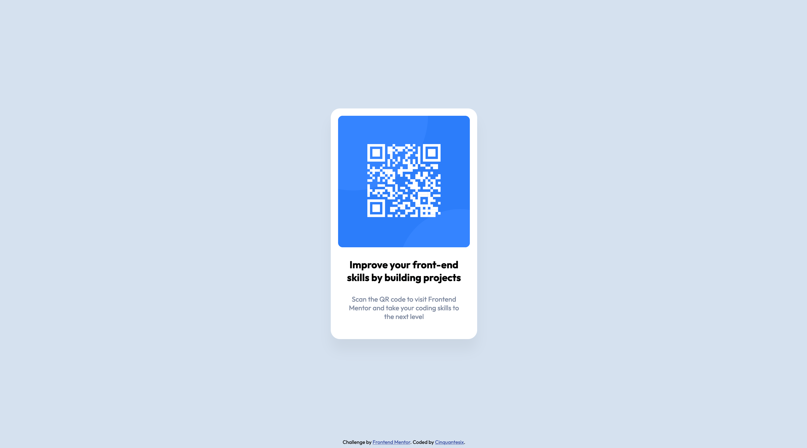

# Frontend Mentor - QR code component solution

This is a solution to the [QR code component challenge on Frontend Mentor](https://www.frontendmentor.io/challenges/qr-code-component-iux_sIO_H). Frontend Mentor challenges help you improve your coding skills by building realistic projects. 

## Table of contents

- [Overview](#overview)
  - [Screenshot](#screenshot)
  - [Links](#links)
- [My process](#my-process)
  - [Built with](#built-with)
  - [What I learned](#what-i-learned)
- [Author](#author)

## Overview

### Screenshot

### Links

- Solution URL: [solution URL](https://github.com/Cinquantesix/qr-code-component-main)
- Live Site URL: [live site URL](https://resplendent-vacherin-a13026.netlify.app/)

## My process

### Built with

- Semantic HTML5 markup
- CSS custom properties

### What I learned

For this challenge, I tried to be clean as possible. I also tried the CSS multy-background behing the qrcode. I also set up a timer to be sure to make less than 1 hour.

I'd never use Figma so it was my first time. Pretty easy to use and really helpfull for the size and placement. I also use it to copy style like box shadow because of the very specific properties. 

## Author

- Frontend Mentor - [@Cinquantesix](https://www.frontendmentor.io/profile/Cinquantesix)
- Instagram - [@cinquante_six](https://www.instagram.com/cinquante_six/)
